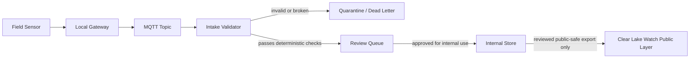

# Architecture Sketch

This sketch is intentionally lightweight. It shows the trust boundary for future sensor data without implying a deployed pipeline.

## Boundary Notes

- The local gateway and MQTT layer are internal transport surfaces.
- The intake validator is where fail-closed behavior starts.
- Quarantine and dead-letter paths preserve auditability without turning bad records into public claims.
- Clear Lake Watch should read only reviewed public-safe exports, not raw sensor traffic.
