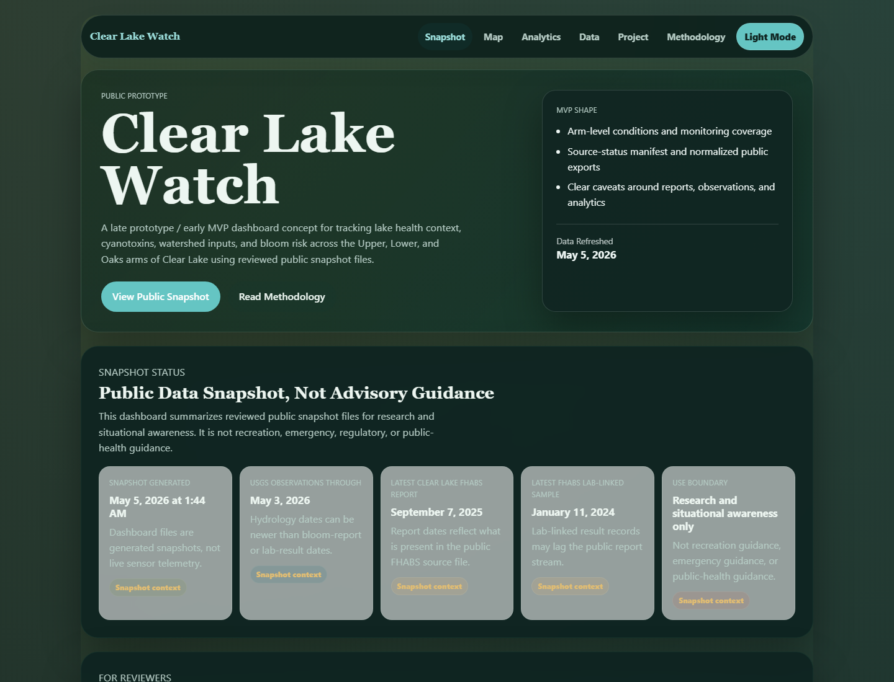

# Dashboard Anatomy Review Guide

**Status:** public portfolio review aid  
**Audience:** Career Services, internship reviewers, scholarship reviewers, faculty mentors, and technical reviewers  
**Prepared:** 2026-05-14  

This guide explains how to review the Clear Lake Watch dashboard as a portfolio artifact. It focuses on what the interface demonstrates about environmental data systems, GIS review, uncertainty handling, and responsible public communication.

Clear Lake Watch is a late prototype / early MVP. It is not official public-health guidance, an official advisory, recreation guidance, emergency guidance, a validated forecast, or a deployed sensor network.

## Primary Screenshot

## What To Inspect First

| Dashboard area | What reviewers should notice | What it demonstrates |
| --- | --- | --- |
| Public prototype header | The page labels itself as a late prototype / early MVP and points to methodology before interpretation. | Conservative product framing and public-health boundary discipline. |
| Snapshot status strip | Dashboard generation time is separated from source observation dates. | Source-freshness awareness and avoidance of misleading "live" claims. |
| Best First Reads | Reviewers are routed to methodology, data products, site-registry QA, evidence summary, and portfolio case study. | Reviewer-friendly documentation design. |
| What This Project Demonstrates | The homepage now states the portfolio evidence directly: data integration, GIS review, public communication, and research-to-product workflow. | Career Services and hiring reviewers can understand the skill signal quickly. |
| Open-App Data QA Notices | Local browser notices are framed as data QA notices, not emergency alerts or public-health notifications. | Sensitive-language correction and responsible risk communication. |
| Map QA section | Current map markers keep unresolved site assignments visible. | Spatial uncertainty is treated as review evidence, not hidden as a defect. |
| Data products section | Public JSON exports and source manifest are visible as data products, not just interface decorations. | Reproducible static civic-data architecture. |
| Methodology link | Interpretation rules and limitations are one click away from the dashboard. | Transparent methods and public-use guardrails. |

## Reviewer Walkthrough

1. Open the live dashboard: <https://coreytshaffer.github.io/clear-lake-watch/>.
2. Confirm that the dashboard says it is a public prototype, not an advisory system.
3. Review the snapshot status strip and identify the difference between dashboard refresh date and source observation dates.
4. Review the "What This Project Demonstrates" section and connect each card to a career skill.
5. Review the Open-App Data QA Notices wording and confirm it does not imply emergency or public-health alerting.
6. Open the map section and confirm unresolved markers remain labeled for local review.
7. Open the methodology page and confirm the project separates public reports, observations, derived summaries, and limitations.

## Best Interview Talking Points

- I built Clear Lake Watch as a static public-data dashboard, which keeps deployment simple and reviewable.
- I separated source freshness from dashboard refresh time because "new dashboard file" does not mean "new environmental observation."
- I kept unresolved site assignments visible because hiding uncertainty would make the map look more authoritative than it is.
- I renamed alert-like language to data QA notices to avoid implying public-safety authority.
- I created reviewer-facing documentation so nontechnical reviewers can inspect the project without reading the entire codebase.

## What This Does Not Prove

- It does not prove real-time lake conditions.
- It does not prove a deployed sensor network.
- It does not prove field validation.
- It does not issue public-health, recreation, emergency, regulatory, or official advisory guidance.
- It does not replace official monitoring or advisories.

## Related Review Files

- [Clear Lake Watch v0.1 evidence summary](clear-lake-watch-v0.1-evidence-summary.md)
- [Portfolio evidence index](portfolio-evidence-index.md)
- [Reviewer demo notes](reviewer-demo-notes.md)
- [Methodology](../methodology.html)
- [Project page](../project.html)

